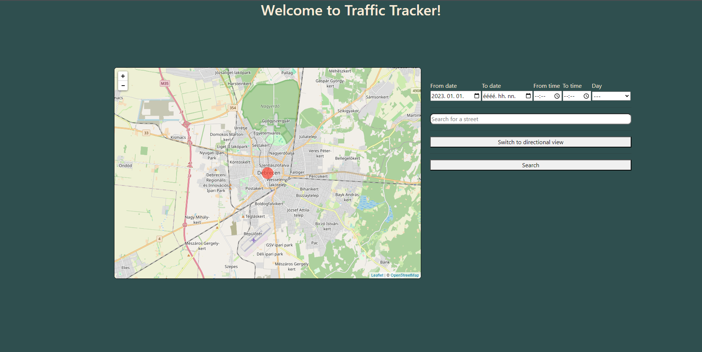

# System plan

## System:
The project is a website made with HTML/CSS and JavaScript which accesses a simplified dataset of the traffic in Debrecen and visualizes it according to the user’s input. The map will be displayed using Leaflet and OpenStreetMap both of which are open source.

## The goal of the system:
The goal with this project is not to hand hold and tell the user that they should start their drive at a given time or take a given route, but to give them information so that they can make a choice that works for them. 
With this project I aim to create a website that is not like other maps but one the user only needs to open once or twice a month. It won’t give the user directions, but it will tell the user where traffic is worse and based on that a choice can be made about daily, mostly unchanging routines. I think this website will help those people the most who recently started at new job, school or had a new trip added to their daily drive.
## Plan:
### Start
User- The person using the site at any given time.
The user opens the website

### Date and time
The user specifies a time to the accuracy they wish. This can be an exact date and time, a date, a date range,  a weekday, etc.

### Street search
The user if they choose can enter an address to narrow the view of the map to a single street. This will be implemented using Nominatim. Which is a search api for OpenStreetMap.

### View selection
The default view will be a hotspot view which shows outlines of the areas with heavy traffic.
The second view is directional view which will show the direction of traffic

### Map
The map will use as the main place for visualization as the data will be applied to it using overlays. The user will be able to freely interact with the map.

### A real life example
User: Bob
Situation: Bob starts at a new job next week and needs to find out when he should leave so that he isn’t too early and neither is he late.
Use case: Checking usual traffic at given times
1. Bob knows he can get to work in 20 minutes and assumes traffic will double that.
2. Bob opens the website
3. Bob inputs a time he feels is reasonable to leave at which is 7:30 so he should arrive at 7:50 without traffic and 8:10 with traffic.
4. He notices that at that time every road he takes is filled with traffic.
5. Bob reduces the time by 10 minutes and sees that there is close to no traffic at 7:20 and he will arrive at 7:40. 
6. Bob sees that if he leaves 10 minutes early he is sure to arrive. 
 
This example show the intended use case for the website. Bob didn’t know whether there would be traffic at 7:30 so without the site he would have to guess, but with the help of the site he knows that if he leaves at 7:30 he will be late. 

## Implementation plan:
### JavaScript 
JavaScript is a programming language which allows us to create dynamic websites. The language is easy to pick up, widely used and supported by all modern browsers. 

### Python 
Python is a scripting language which works well with large sets of data and will allow us to simplify our traffic data.

### OpenStreetMap
OpenStreetMap is a free, editable map of the whole world that is being built by volunteers largely from scratch and released with an open-content license.

### Leaflet
Leaflet is the leading open-source JavaScript library for mobile-friendly interactive maps. Weighing just about 42 KB of JS, it has all the mapping features most developers ever need. 
